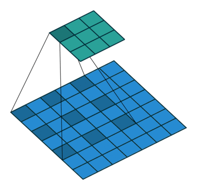

# Layers

## Linear

$$
\begin{aligned}

y = xW + b

\end{aligned}
$$


```python
class Linear:
    def __init__(self, w, b):
        self.w = w
        self.b = b

        self.w_grad = None
        self.b_grad = None

    def forward(self, x):
        self.x = x
        return np.matmul(x, self.w) + self.b
    
    def backward(self, dout):
        self.dw = np.matmul(self.x.T, dout)
        self.db = dout

```

## Convolution


$$
\begin{aligned}

G_{k, l, n} = \displaystyle\sum_{i, j, m}{K_{i, j, m, n} * x_{k+i-1, l+j-1, m}} + b

\end{aligned}
$$

## depthwise Convolution

$$
\begin{aligned}

G_{k, l, m} = \displaystyle\sum_{i, j}{K_{i, j, m} * x_{k+i-1, l+j-1, m}}\\

G_{k, l, n} = \displaystyle\sum_{m}{K_{m} * x_{m}}

\end{aligned}
$$

## depthwise Convolution

$$
\begin{aligned}

G_{k, l, m} = \displaystyle\sum_{i, j}{K_{i, j, m} * x_{k+i-1, l+j-1, m}}\\

G_{k, l, n} = \displaystyle\sum_{m}{K_{m} * x_{m}}

\end{aligned}
$$

## deconvolutation


## dilated/atrouse convolution



## AvgPool

$$
\begin{aligned}

y_{n, c, l} = \frac{1}{k}\displaystyle\sum_{m=0}^{k-1}{x_{n, c, stribe \times l + m}}

\end{aligned}
$$

## MaxPool

$$
\begin{aligned}

y_{n, c, l} = max{x_{n, c, stribe \times k + m}}

\end{aligned}
$$

## Residual

$$
\begin{aligned}

y = func(x) + x

\end{aligned}
$$

## BatchNorm

$$
\begin{aligned}

y = \frac{x - E[x]}{\sqrt{var[x]}}

\end{aligned}
$$

## LayerNorm

$$
\begin{aligned}

y = \frac{x - E[x]}{\sqrt{var[x]}}

\end{aligned}
$$

## Attention

$$
\begin{aligned}

\mathrm{Attention}(Q,K,V)=\mathrm{softmax}(\frac{QK^{T}}{\sqrt{d_{k}}})V

\end{aligned}
$$